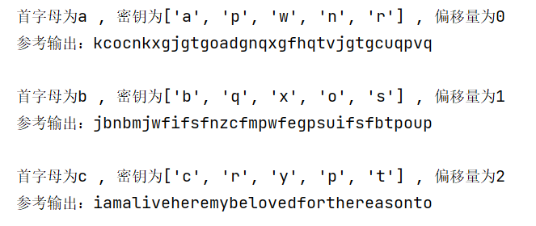

维吉尼亚密码（Vigenère Cipher）是一种经典的多表替换密码，通过多组凯撒密码循环叠加实现加密，相比单表替换密码（如凯撒密码）安全性更高，手动破解难度较大。

本工具基于密码学中的重合指数（Index of Coincidence, IC）和互重合指数（Mutual Index of Coincidence, MIC），结合英文文本的统计特征（英文文本平均重合指数约为 0.065），实现维吉尼亚密码的自动化破解。

文件说明

Vigenere-crack.py：破解脚本，包含密文预处理、密钥长度推测、密钥还原、明文解密等功能

cipher1.txt：存储待破解的维吉尼亚密文（支持大小写字母）

运行后，程序输出**部分明文**与备选密钥，参考输出的明文，选择其中有意义的明文，输入最优偏移量，即可得到完整明文

分词功能依赖wordninja库，用于优化解密后英文文本的可读性

示例:

偏移量为2时明文有具体含义：

i am alive here my beloved for the reason to

输入偏移量2后，得到具体明文内容

iam alive here my beloved for the reason to adore you oh how anxious i
 have been for you and how sorry iam about all you must have suffered 
in having no news from us may heaven grant that this letter reaches yo
u do not write tome this would compromise all of us and above all do n
ot return under any circumstances it is known that it was you who help
ed us to getaway from here and all would be lost if you should show yo
urself we are guarded day and night ido not care you are no there do n
ot be troubled on my account nothing will happen tome the national ass
emble will show leniency farewell the most loved of men be quiet if yo
u can take care of yourself for myself i cannot write anymore but noth
ing in the world could stop me to adore you up to the death
